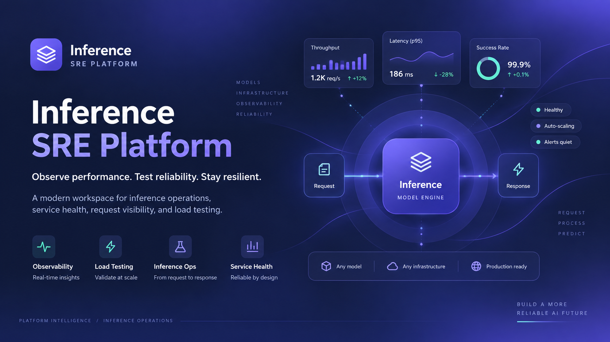

# Inference SRE K8s Platform

<p align="center">
  
</p>

<p align="center">
  A React + Node.js cloud-native platform for simulating and monitoring AI inference workloads on Kubernetes.
  <br />
  It demonstrates production-style Kubernetes deployment, GitOps, autoscaling, networking, persistent storage,
  observability, and SRE practices around a lightweight CPU-based inference service.
</p>

<p align="center">
  <a href="./docs/project-setup.md"><strong>Project Setup</strong></a> ·
  <a href="./docs/kubernetes-setup.md"><strong>Kubernetes Setup</strong></a> ·
  <a href="./docs/architecture.md"><strong>Architecture</strong></a> ·
  <a href="./docs/demo-guide.md"><strong>Demo Guide</strong></a>
</p>

<p align="center">
  
  
  
  
  
  
  
  
  
</p>

## Highlights

* React dashboard for visualising synthetic AI inference traffic, latency, errors, queue depth, service health, and model versions.
* Node.js + Express backend that simulates lightweight CPU-based inference workloads.
* Separate frontend and backend Kubernetes Deployments with internal `ClusterIP` Services.
* Kustomize base and overlays for `development`, `staging`, and `production`.
* Development exposure through Kubernetes `NodePort`.
* PostgreSQL deployed as a StatefulSet with PersistentVolume and PersistentVolumeClaim in local environments.
* External Supabase PostgreSQL support for production.
* Redis for request counters, short-lived state, caching, and queue simulation.
* Prometheus metrics for application and inference observability.
* Grafana dashboards for SRE and Kubernetes monitoring.
* Horizontal Pod Autoscaler demonstrations using generated inference traffic.
* Kubernetes readiness and liveness probes.
* Ingress and egress NetworkPolicies between application components.
* ConfigMap and Secret based environment configuration.
* GitHub Actions for testing, validation, container builds, and image publishing.
* Argo CD for GitOps-based continuous deployment.
* Helm-based installation and configuration of supporting platform components.
* Synthetic workloads only; the project contains no proprietary infrastructure or employer operational data.

## Overview

Inference SRE K8s Platform is a cloud-native application designed primarily to demonstrate Kubernetes, SRE, GitOps, observability, and AI platform engineering practices.

The product workload is intentionally lightweight.

Rather than running a GPU-heavy AI model, the backend simulates an inference service that accepts requests, introduces configurable processing latency, records request outcomes, exposes Prometheus metrics, and returns synthetic inference results.

The system consists of:

* React for the user-facing SRE dashboard and traffic simulation interface.
* Node.js + Express for the inference API and platform backend.
* Redis for fast counters, caching, temporary state, and queue-related metrics.
* PostgreSQL for persistent inference history, service events, and model metadata.
* Kubernetes for workload deployment, networking, scaling, configuration, and recovery.
* Prometheus for metrics collection.
* Grafana for infrastructure and application observability.
* GitHub Actions for continuous integration.
* Argo CD for GitOps-based deployment.
* Kustomize for environment-specific Kubernetes configuration.
* Helm for reusable package and dependency deployment.

The project does not attempt to reproduce a commercial AI cloud platform.

Its purpose is to provide a realistic workload through which Kubernetes and AI infrastructure engineering concepts can be demonstrated safely in a public portfolio.

## What This Project Can Do

### Inference dashboard

* Display total inference requests.
* Display requests per second.
* Display successful and failed request counts.
* Display current inference error rate.
* Display P50, P95, and P99 request latency.
* Display simulated inference queue depth.
* Display the currently active model version.
* Display service health status.
* Display backend replica count.
* Display recent inference requests.
* Display CPU and memory utilisation from monitoring data.
* Visualise inference traffic and latency trends.

### Synthetic inference workload

* Submit inference requests from the React dashboard.
* Generate configurable synthetic inference traffic.
* Simulate normal inference responses.
* Simulate configurable latency.
* Simulate request failures.
* Record inference request duration.
* Track the model version serving each request.
* Persist inference history for later inspection.

### SRE scenarios

* Generate increased traffic to demonstrate horizontal autoscaling.
* Simulate elevated inference latency.
* Simulate backend request failures.
* Delete backend Pods and observe Kubernetes self-healing.
* Perform rolling application updates.
* Observe application recovery through readiness and liveness probes.
* Compare service behaviour before and after autoscaling.
* Visualise incidents and degradation through Grafana dashboards.

### Kubernetes platform

* Deploy React and Node.js as separate Kubernetes workloads.
* Connect application components using `ClusterIP` Services.
* Expose the development frontend through `NodePort`.
* Configure environment-specific deployments using Kustomize.
* Persist local database data using PV and PVC.
* Deploy PostgreSQL as a StatefulSet.
* Use external Supabase PostgreSQL in production.
* Deploy and configure Redis.
* Configure application values using ConfigMaps.
* Store credentials and sensitive values using Secrets.
* Restrict application traffic using NetworkPolicies.
* Configure resource requests and limits.
* Configure Horizontal Pod Autoscaling.
* Install supporting services with Helm.
* Synchronise Git-managed Kubernetes configuration through Argo CD.

## How It Works

1. The React frontend loads the current inference service summary from the Node.js backend.
2. A user submits a synthetic inference request or starts a traffic simulation.
3. The frontend sends the request to the backend through the internal application API.
4. The backend validates the request and creates an inference request ID.
5. Redis updates short-lived counters and queue-related state.
6. The backend performs lightweight CPU-based inference simulation.
7. Request latency, outcome, and model version are recorded.
8. Persistent request information is saved to PostgreSQL.
9. Prometheus collects application and infrastructure metrics.
10. Grafana visualises service health, latency, throughput, errors, and Kubernetes resource usage.
11. Increased traffic raises backend resource utilisation.
12. Kubernetes HPA can increase the number of backend replicas when configured thresholds are reached.
13. Argo CD continuously compares the Kubernetes cluster against the desired Git state and synchronises approved changes.

## Application Architecture

```text
User
 │
 ▼
React Frontend
Deployment
 │
 ▼
Frontend Service
ClusterIP
 │
 ▼
Node.js Inference API
Deployment
 │
 ▼
Backend Service
ClusterIP
 │
 ├───────────────┐
 │               │
 ▼               ▼
Redis         PostgreSQL
ClusterIP     StatefulSet
                 │
                 ▼
                PVC
                 │
                 ▼
                 PV
```

Production replaces the local PostgreSQL workload with an external Supabase PostgreSQL database.

```text
Production Backend
       │
       ├──────────► Redis
       │
       └──────────► Supabase PostgreSQL
```

## Observability Architecture

```text
React Frontend
      │
      ▼
Node.js Backend
      │
      ├── /health/live
      ├── /health/ready
      └── /metrics
              │
              ▼
          Prometheus
              │
              ▼
            Grafana
```

Prometheus collects both infrastructure and application-level metrics so that the project demonstrates more than basic Kubernetes CPU and memory monitoring.

## SRE Metrics

The backend exposes metrics such as:

```text
inference_requests_total
inference_success_total
inference_errors_total
inference_request_duration_seconds
inference_queue_depth
model_version_info
redis_cache_hits_total
redis_cache_misses_total
http_requests_total
http_request_duration_seconds
```

Grafana can use these metrics to visualise:

* Inference throughput.
* P50 / P95 / P99 latency.
* Error rate.
* Success rate.
* Queue depth.
* Backend replica count.
* CPU utilisation.
* Memory utilisation.
* Redis activity.
* Model version.
* HTTP request performance.

## Environment Strategy

The project uses one Kubernetes base with three Kustomize overlays.

### Development

```text
Frontend replicas:        1
Backend replicas:         1
Exposure:                 NodePort
Database:                 PostgreSQL StatefulSet
Persistent storage:       PV + PVC
Redis:                    Enabled
Monitoring:               Lightweight / optional
Resource limits:          Small
```

### Staging

```text
Frontend replicas:        2
Backend replicas:         2
Database:                 PostgreSQL StatefulSet
Persistent storage:       PV + PVC
Redis:                    Enabled
Prometheus:               Enabled
Grafana:                  Enabled
NetworkPolicy:            Enabled
Health probes:            Enabled
```

### Production

```text
Frontend replicas:        Multiple
Backend replicas:         Multiple
Backend HPA:              Enabled
Database:                 Supabase PostgreSQL
Redis:                    Enabled
Prometheus:               Enabled
Grafana:                  Enabled
NetworkPolicy:            Strict
GitOps:                   Argo CD
External exposure:        Ingress
```

## Network Model

Application traffic is restricted so services communicate only where required.

```text
Internet
   │
   ▼
Ingress / NodePort
   │
   ▼
Frontend
   │
   │ allowed
   ▼
Backend
   │
   ├────────► Redis
   │
   ├────────► PostgreSQL
   │
   └────────► DNS
```

Example restrictions include:

* Frontend ingress is allowed only through the configured application entry point.
* Frontend egress is restricted to the backend API and required DNS traffic.
* Backend ingress is restricted to the frontend and approved monitoring components.
* Redis ingress is restricted to the backend.
* PostgreSQL ingress is restricted to the backend.
* Production backend egress allows the required Supabase connection.
* Unnecessary ingress and egress traffic is denied.

## Data Model At A Glance

The application primarily works with the following data entities:

### `inference_requests`

* `id`
* `model_version`
* `input_type`
* `status`
* `latency_ms`
* `created_at`

### `model_versions`

* `id`
* `name`
* `version`
* `status`
* `created_at`

### `service_events`

* `id`
* `event_type`
* `severity`
* `message`
* `created_at`

Redis stores temporary or frequently accessed values such as:

```text
inference:requests:active
inference:queue:depth
inference:requests:recent
inference:errors:recent
```

Redis is not treated as the durable source of truth.

## Quick Start

### Prerequisites

* Node.js LTS
* npm
* Git
* Docker
* Docker Compose
* Kubernetes cluster such as Minikube or Kind
* `kubectl`
* Kustomize support through `kubectl`
* Helm
* Argo CD for the GitOps phase

### Clone the repository

```bash
git clone <repository-url>
cd inference-sre-k8s-platform
```

### Frontend setup

```bash
cd frontend
npm install
npm run dev
```

The development frontend runs by default at:

```text
http://localhost:5173
```

### Backend setup

Open another terminal:

```bash
cd backend
npm install
npm run dev
```

The development backend runs by default at:

```text
http://localhost:3000
```

### Test backend health

```bash
curl http://localhost:3000/health/live
```

Expected response:

```json
{
  "status": "healthy",
  "service": "inference-api"
}
```

## Local Development

During application development, the basic flow is:

```text
React
localhost:5173
     │
     ▼
Node.js
localhost:3000
     │
     ├── Redis
     │
     └── PostgreSQL
```

The Kubernetes layer is added after the frontend and backend application flows are functional locally.

## Example Inference Request

```http
POST /api/v1/inference
```

Example request:

```json
{
  "model": "classifier-v1",
  "input": "example inference payload"
}
```

Example response:

```json
{
  "requestId": "req-10428",
  "model": "classifier-v1",
  "latencyMs": 42,
  "status": "success"
}
```

## API At A Glance

Initial application endpoints include:

```text
POST   /api/v1/inference
GET    /api/v1/inference
GET    /api/v1/inference/:id

POST   /api/v1/load-test

GET    /api/v1/dashboard/summary
GET    /api/v1/models

GET    /health/live
GET    /health/ready
GET    /metrics
```

## Traffic Spike Demo

The platform includes a synthetic traffic generator so Kubernetes autoscaling can be demonstrated.

```text
Normal Traffic
      │
      ▼
2 Backend Pods
      │
      ▼
Generate Load
      │
      ▼
Request Rate Increases
      │
      ▼
CPU Utilisation Increases
      │
      ▼
HPA Triggered
      │
      ▼
2 Pods → 4 Pods → 6 Pods
      │
      ▼
Traffic Stabilises
```

Grafana can be used alongside the demo to visualise the change in request rate, resource utilisation, latency, and Pod replicas.

## Failure Recovery Demo

A backend Pod can be deliberately removed:

```bash
kubectl delete pod <backend-pod-name>
```

The expected flow is:

```text
Backend Pod Deleted
        │
        ▼
Replica Count Drops
        │
        ▼
Kubernetes Detects Missing Replica
        │
        ▼
Replacement Pod Created
        │
        ▼
Readiness Probe Passes
        │
        ▼
Service Receives Traffic Again
```

This demonstrates Kubernetes self-healing without requiring an artificial application feature specifically for failure recovery.

## CI/CD And GitOps

The intended delivery workflow is:

```text
Developer
   │
   ▼
GitHub
   │
   ▼
GitHub Actions
   │
   ├── Install dependencies
   ├── Run tests
   ├── Run linting
   ├── Build application
   ├── Build Docker images
   └── Push images
             │
             ▼
       Container Registry

GitOps Configuration
        │
        ▼
      Argo CD
        │
        ▼
     Kustomize
        │
 ┌──────┼──────┐
 ▼      ▼      ▼
Dev   Staging  Prod
        │
        ▼
    Kubernetes
```

Application deployment changes are managed declaratively through Git rather than through manual production `kubectl apply` commands.

## Kustomize Layout

```text
k8s/
├── base/
│   ├── frontend/
│   ├── backend/
│   ├── redis/
│   ├── postgres/
│   ├── network-policy/
│   └── kustomization.yaml
│
└── overlays/
    ├── dev/
    │   └── kustomization.yaml
    │
    ├── staging/
    │   └── kustomization.yaml
    │
    └── prod/
        └── kustomization.yaml
```

Each overlay modifies the shared base according to the requirements of its environment.

## Helm

Helm is used for reusable platform packages and supporting dependencies.

Potential Helm-managed components include:

* Prometheus
* Grafana
* Redis
* Application chart packaging

Application-specific environment differences remain manageable through the project's Kustomize structure.

## ConfigMap And Secret Management

Non-sensitive application settings are stored through ConfigMaps.

Examples:

```text
NODE_ENV
MODEL_VERSION
INFERENCE_LATENCY_MODE
LOG_LEVEL
REDIS_HOST
```

Sensitive settings are stored through Kubernetes Secrets.

Examples:

```text
DATABASE_URL
REDIS_PASSWORD
SUPABASE_DATABASE_URL
```

Real production credentials must not be committed directly to Git.

## Health Checks

The backend provides dedicated endpoints for Kubernetes probes.

### Liveness

```text
GET /health/live
```

Used to determine whether the backend process is alive.

### Readiness

```text
GET /health/ready
```

Used to determine whether the backend is ready to receive application traffic.

The readiness endpoint can validate critical dependencies such as:

* Redis connectivity.
* Database connectivity.
* Application initialisation state.

## Typical End-To-End Demo Flow

1. Open the React SRE dashboard.
2. Confirm that the inference service is healthy.
3. Submit a normal inference request.
4. View the request latency and result.
5. Confirm that the request appears in inference history.
6. Open Grafana and observe application metrics.
7. Start a synthetic traffic test.
8. Observe request throughput and CPU usage increase.
9. Observe Kubernetes HPA increase the number of backend Pods.
10. Stop the traffic generator.
11. Observe the workload eventually scale down.
12. Delete one backend Pod manually.
13. Observe Kubernetes recreate the missing Pod.
14. Commit an application version change to Git.
15. Allow GitHub Actions to test and build the new container image.
16. Update the GitOps configuration.
17. Observe Argo CD detect and synchronise the deployment.
18. Confirm the new model or application version appears on the dashboard.

## Testing

Frontend tests:

```bash
cd frontend
npm test
```

Backend tests:

```bash
cd backend
npm test
```

Useful backend test areas include:

* Inference request validation.
* Health endpoint behaviour.
* Synthetic latency generation.
* Synthetic failure generation.
* Redis counter behaviour.
* Database persistence.
* Prometheus metrics.
* Dashboard summary calculations.

Kubernetes configuration should also be validated before deployment.

Examples:

```bash
kubectl kustomize k8s/overlays/dev
kubectl kustomize k8s/overlays/staging
kubectl kustomize k8s/overlays/prod
```

## Repository Structure

```text
frontend/
  src/
    components/                       Shared React components
    features/                         Dashboard and inference features
    pages/                            Application pages
    services/                         Backend API integration
    hooks/                            Shared React hooks
    types/                            TypeScript application types
  Dockerfile
  package.json

backend/
  src/
    routes/                           Express API routes
    controllers/                      Request handling
    services/                         Inference and application services
    repositories/                     Database access
    middleware/                       Express middleware
    metrics/                          Prometheus metrics
    health/                           Readiness and liveness checks
    config/                           Application configuration
  Dockerfile
  package.json

k8s/
  base/                               Shared Kubernetes resources
  overlays/
    dev/                              Development configuration
    staging/                          Staging configuration
    prod/                             Production configuration

helm/                                 Helm charts and values

monitoring/
  prometheus/                         Prometheus configuration
  grafana/                            Grafana dashboards

docs/
  project-setup.md                    Local project setup
  kubernetes-setup.md                 Kubernetes deployment guide
  architecture.md                     Platform architecture
  demo-guide.md                       Portfolio demonstration flow

.github/
  workflows/                          GitHub Actions pipelines

assets/images/                        README and architecture images

README.md
```

## Project Documents

* [`docs/project-setup.md`](./docs/project-setup.md): local React, Node.js, Redis, and PostgreSQL setup.
* [`docs/kubernetes-setup.md`](./docs/kubernetes-setup.md): Kubernetes deployment and environment setup.
* [`docs/architecture.md`](./docs/architecture.md): application and platform architecture.
* [`docs/demo-guide.md`](./docs/demo-guide.md): recommended Kubernetes and SRE demonstration flow.
* [`k8s/`](./k8s/): Kubernetes base and environment overlays.
* [`helm/`](./helm/): Helm packaging and supporting components.
* [`monitoring/`](./monitoring/): Prometheus and Grafana configuration.

## Current Implementation Notes

* The inference workload is intentionally lightweight and CPU-based.
* GPU hardware is not required to run the project.
* Synthetic inference traffic is used instead of real customer or production workloads.
* The application is designed as a Kubernetes showcase rather than a production AI model benchmark.
* Development and staging use locally managed PostgreSQL to demonstrate StatefulSet and persistent storage concepts.
* Production is designed to use Supabase PostgreSQL to demonstrate external managed database integration.
* Redis provides low-latency temporary state but is not treated as the durable source of truth.
* Prometheus and Grafana are intended to monitor both Kubernetes infrastructure and inference application behaviour.
* Production credentials and external service secrets must not be committed to the repository.
* All infrastructure names, workloads, metrics, and datasets used in this project are synthetic and independent of any employer environment.

## Project Scope

This project deliberately prioritises platform engineering over application feature complexity.

The primary areas being demonstrated are:

```text
Kubernetes
Kustomize
Helm
GitOps
Argo CD
GitHub Actions
Docker
ClusterIP Services
NodePort
Ingress
NetworkPolicy
ConfigMap
Secret
StatefulSet
PV / PVC
Redis
PostgreSQL
Supabase
Prometheus
Grafana
Health Probes
Autoscaling
Self-Healing
Rolling Deployment
SRE Observability
```

The React and Node.js application exists as a realistic AI inference workload on which these infrastructure concepts can be demonstrated.

## Public Portfolio Notice

This is an independent educational and portfolio project.

It does not reproduce or expose proprietary infrastructure, customer data, internal monitoring systems, hostnames, operational procedures, production configurations, or confidential information from any employer.

All inference traffic, service events, metrics, infrastructure names, and operational scenarios used by the project are synthetic.

## Contribution And Feedback

If you are extending or reviewing this project, the highest-value areas include:

* Kubernetes manifest quality and consistency.
* Kustomize environment separation.
* NetworkPolicy correctness.
* GitOps workflow design.
* Redis and PostgreSQL reliability.
* StatefulSet and persistent storage behaviour.
* Autoscaling configuration.
* Prometheus metric quality.
* Grafana dashboard usefulness.
* readiness and liveness probe behaviour.
* resource requests and limits.
* CI/CD security and reliability.
* failure recovery and rolling deployment scenarios.
* documentation that makes the architecture easy to reproduce.

Small, focused pull requests and documentation improvements are preferred so the repository remains easy to understand as a Kubernetes and AI platform engineering showcase.
